# XGIflytekToUE
## Brief
This is My IflytekToUE Project.  
It Contains Two Plugins. About Text To Speech,Speech To Text,Spark and So on.
The first is XGIflytekToUE Plugin,which is commerical code commercial.   
The Second is XGKeDaXunFeiSoud Plugins,containing learning versions code,which is contains Videos to help you study how to code every line. Maybe there are some bugs,no need to fix.

Commercial use is prohibited without permission!
If you need Commercial use,Please purchase it In UE Marketspace

这是小刚封装的科大讯飞的能力到UE插件  
第一个插件完全是商业化封装的插件
第二个插件是一款学习插件，包含了大量代码视频，可以帮助你理解每一行代码字是如何写出来的。或许，有一些bug，但是没必要去修复。  

未经许可,不允许商业化使用~
如有需要,请到UE商城进行购买~

## XGIflytekToUE  

### Real Time Speech To Text  

DemoVideoUrl:
#### Get your iFlytek Appid and AppKey
WebApi ,we do not need App Secret. If you are new person coder,you can get free try for 5 hours in one year.  
You need create you own APP firstly.
Please Http this Web.  
https://www.xfyun.cn/services/rtasr#anchor4503211  
https://www.xfyun.cn/free  

  

In your contoller Center ,you will see AppID and AppKey.  
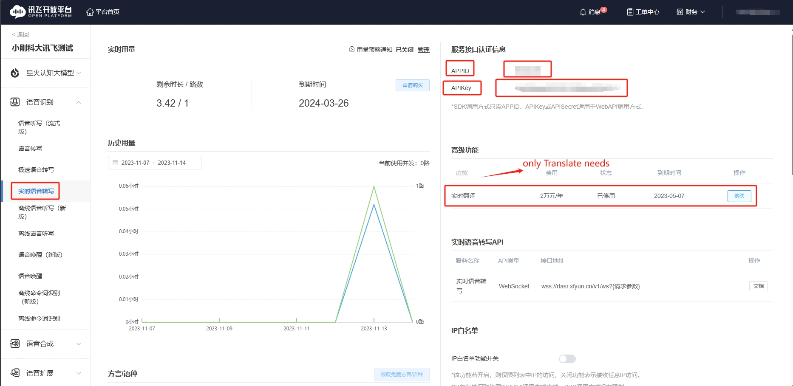  
If you need Translate ,you need open if in this web first~  
iFlyTek RealTime Document:  
https://www.xfyun.cn/doc/asr/rtasr/API.html  

#### Set Realtiem AppID and AppKey in Plugins Settings.
You need input AppID and AppKey in UE Project Settings.

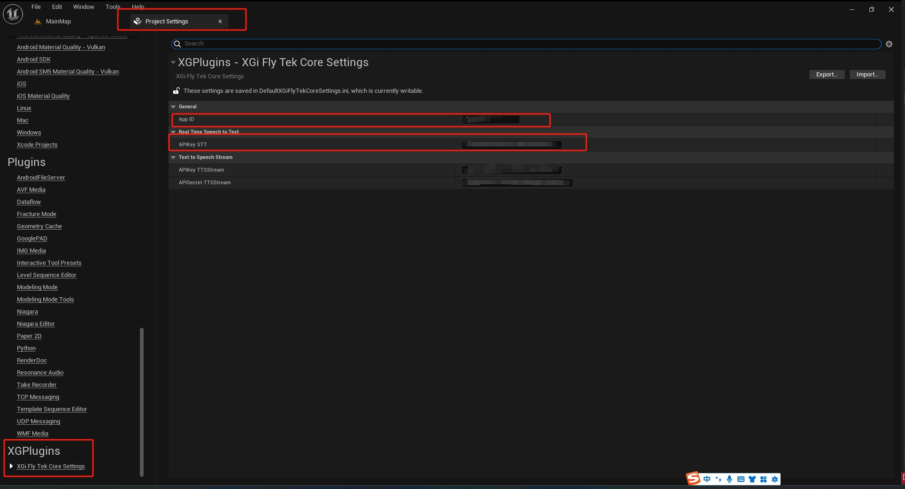  

#### Start And End RealTime SST  

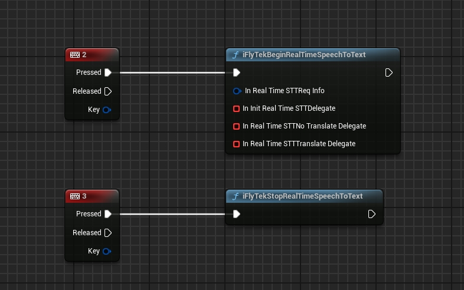    

you can directly Begin from this procedure.  

Be Careful,Defuat Settings is no translate ,and speech is Chinses~    

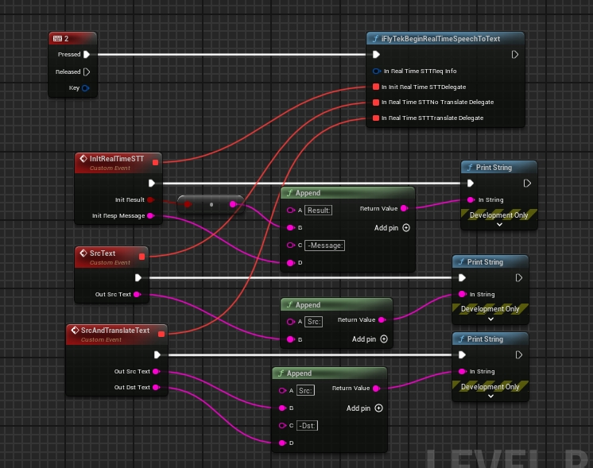  
#### RealTime SST Settings

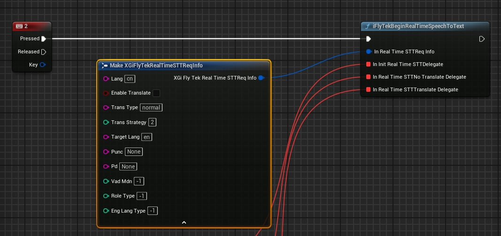  

When your mouse hover this varible,you can see some annotation. you can get more at iFlyTekDocument.  
Simpley say it:
Lang:  this your Speech lanauge~ Such as Chinese -cn,English-en  
Enable Translate: Whether push out translte text. only true .TransType ,TransStrategy,TargetLang is useful~.  
Trans Type: just Type.Look more from iFlyTek Document 
Trans Strategy: just Stragtegy to pass to translte.Look more from iFlyTek Document  
Trarget Lang: what language you wang to Transalte to.Look more from iFlyTek Document .Such as Chinese -cn,English-en    
......  
In fact~~Don't care about more.Default is ok~
#### C++Api  

same to blueprint~  
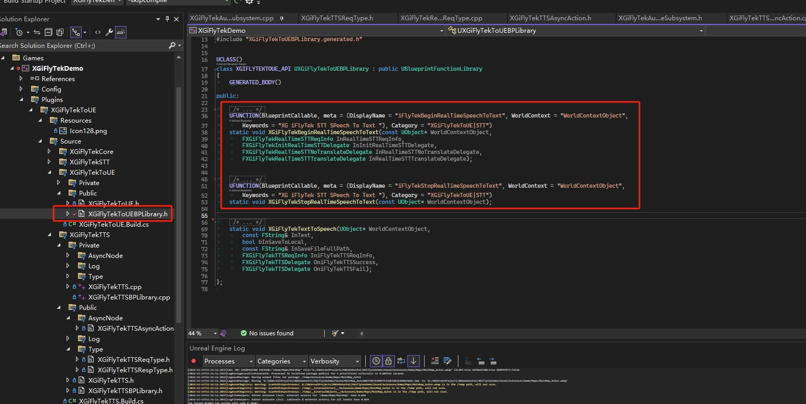  
#### Attention  
you can use it in UE5.1 ,UE5.3,And maybe other verisons.
if you are in ue5.3,  your Audio input device must in  
[48000 kHz,16 bits, 2 channle]  
[48000 kHz,16 bits, 1 channle]  
[16000 kHz,16 bits, 1 channle]

May Fix it Later~~

Like :  

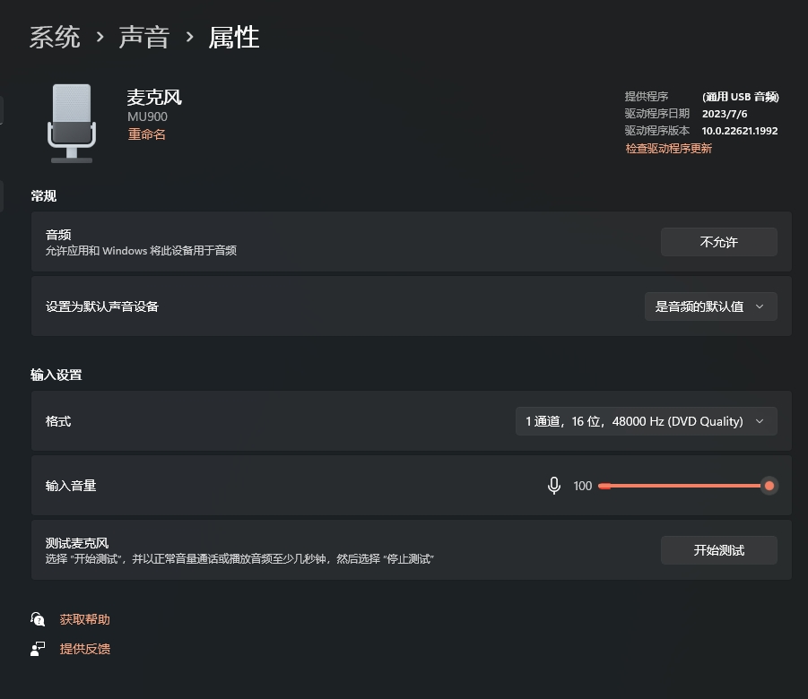  

### Text To Speech  
DemoVideoUrl:  
#### Get your iFlytek Appid ,AppKey,AppSecret  
Same to STT 

    

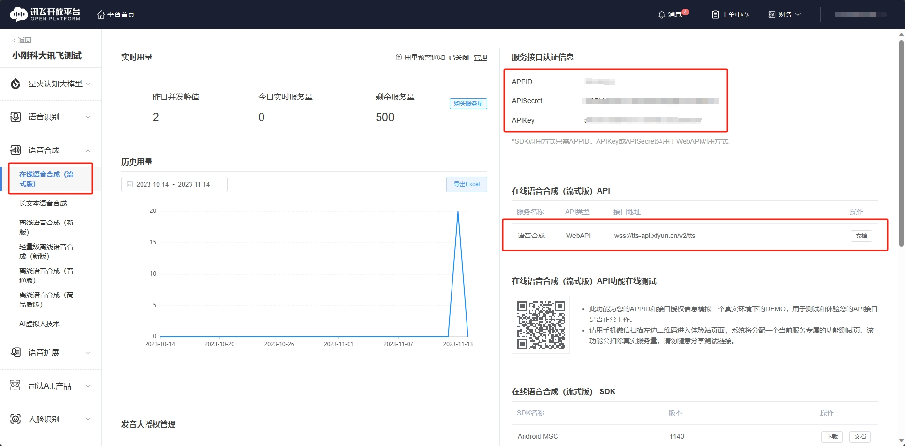    

iFlyTekTTS Document:  
https://www.xfyun.cn/doc/tts/online_tts/API.html  

#### Set your iFlytek Appid ,AppKey,AppSecret  In Plugin Settings  

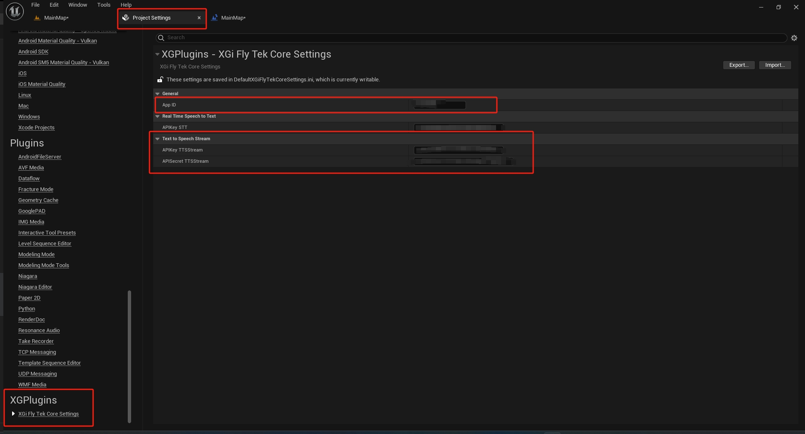    

#### Begin to TTS  

    

You can check  bSaveToLocal and input right file path(absoulte full path,must end with ".wav")

if you sucess ,you will get the USoundWave,you can play it.
if you fail ,you wil get reson.

you can directly use this node by default XGiFlyTekTTSReqBusinessInfo.

if you want to change something ,please look for iFlyTekDocument~

Simply to say:  

Vcn: which voice you can choose.  

such as :  

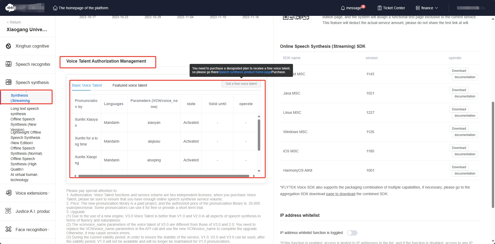      

Speed,Volume,Pitch:0~100  
......
And so on. if your mouse hover it ,some annotion~
#### C++Api  

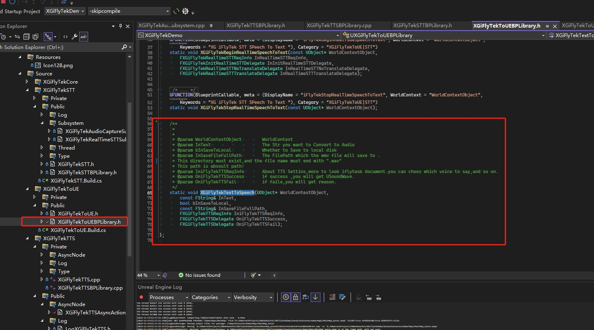      

### Framwork
iFlyTekCore    
base and common api.you do not care about it

iFlyTekSTT    
STT Module

iFLyTekTTS    
TTS Module

iFlyTekToUE    
Anything expose to you for use.
Anything C++ Api you shoule use from  

......\Plugins\XGiFlyTekToUE\Source\XGiFlyTekToUE\Public\XGiFlyTekToUEBPLibrary.h  

Other Api is custom use ,may be not good for common use~~

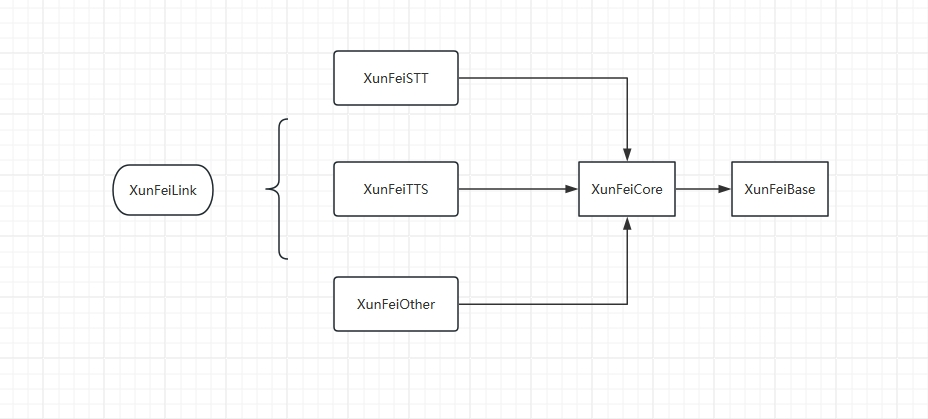

### Package
No problem~

## XGKeDaXunFeiSoud  

StudyVideoUrl:  
https://www.bilibili.com/video/BV11h41137bq/

